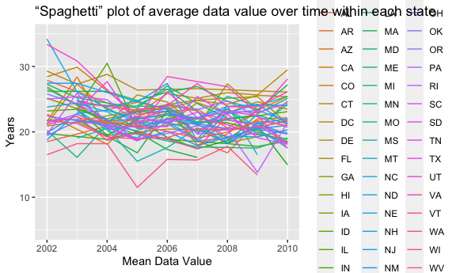
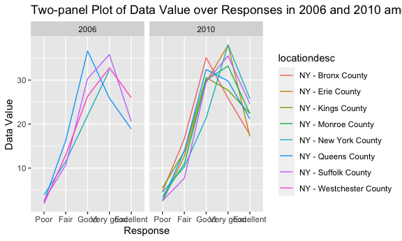
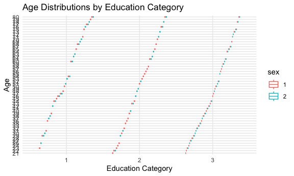

Homework3
================
Siyan Wen
2023-10-12

``` r
library(tidyverse)
```

    ## ── Attaching core tidyverse packages ──────────────────────── tidyverse 2.0.0 ──
    ## ✔ dplyr     1.1.3     ✔ readr     2.1.4
    ## ✔ forcats   1.0.0     ✔ stringr   1.5.0
    ## ✔ ggplot2   3.4.3     ✔ tibble    3.2.1
    ## ✔ lubridate 1.9.2     ✔ tidyr     1.3.0
    ## ✔ purrr     1.0.2     
    ## ── Conflicts ────────────────────────────────────────── tidyverse_conflicts() ──
    ## ✖ dplyr::filter() masks stats::filter()
    ## ✖ dplyr::lag()    masks stats::lag()
    ## ℹ Use the conflicted package (<http://conflicted.r-lib.org/>) to force all conflicts to become errors

``` r
library(ggridges)

knitr::opts_chunk$set(
  fig.width = 6,
  fig.asp = .6,
  out.width = "90%"
)
```

## Problem 1

``` r
library(p8105.datasets)
data("instacart")
```

**Description:**. This dataset contains online grocery data from a
online grocery platform called instacart. The size of this dataset is
`1384617` rows and `15` columns. There are four variables are
`character variables` including evaluation set, product name, aisle and
department. The rest of variables are all `integer variables`. In total,
it has 15 variables including
`order id, product id, customer id, aisle name, department name` and so
on. Department name provide general type information of that specific
product and then aisle name provide the detail information about which
type of product this one belongs to. From the dataset, we can know lots
from information. For example, order number 1 contains 4 Bulgarian
Yogurt that has its product id to be 49302. This Bulgarian Yogurt
belongs to dairy eggs department and also yogurt aisle.

#### The Total number of Aisles

``` r
number_aisle<-
  instacart|>
  count(aisle_id,aisle,sort=TRUE)
```

There are `134` aisle in total within this instacart dataset.
`Fresh vagetable` aisle is the most items ordered from.  
\#### Plot

``` r
number_aisle|>
  filter(n>10000)|>
  ggplot(aes(x=aisle_id,y=n))+
  geom_point()+
  xlim(c(0, 140)) + 
  ylim(c(0, 160000)) + 
  labs(y="Number of Items Ordered", 
       x="Aisle ID", 
       title="Scatterplot of Number of Items Ordered in Each Aisle", 
       )
```


From this plot, we can clearly see that there are two specific aisles
that most items ordered from.  
\#### Table.

#### Table.

## Problem 2

``` r
library(p8105.datasets)
data("brfss_smart2010")
```

#### Clean the data

``` r
brfss_smart2010_clean<-
  brfss_smart2010|>
  janitor::clean_names()|>
  filter(topic=="Overall Health")|>
  filter(response==c("Excellent", "Very good", "Good", "Fair", "Poor"))|>
  mutate(response=factor(response, levels = c("Poor", "Fair", "Good", "Very good", "Excellent"), ordered = TRUE))
```

``` r
brfss_state2002<-brfss_smart2010_clean|>
  filter(year=="2002")|>
  group_by(locationdesc)|>
  summarize(n_obs1=n())|>
  separate(locationdesc,into=c("state", "location"),sep='-')|>
  group_by(state)|>
  summarize(n_obs2=n())|>
  filter(n_obs2>=7)
```

    ## Warning: Expected 2 pieces. Additional pieces discarded in 1 rows [18].

``` r
brfss_state2010<-brfss_smart2010_clean|>
  filter(year=="2010")|>
  group_by(locationdesc)|>
  summarize(n_obs1=n())|>
  separate(locationdesc,into=c("state", "location"),sep='-')|>
  group_by(state)|>
  summarize(n_obs2=n())|>
  filter(n_obs2>=7)
```

    ## Warning: Expected 2 pieces. Additional pieces discarded in 1 rows [49].

In 2002, `no` states were observed at 7 or more locations. In 2010,
there are `9` states were oboserved at 7 or more locations.

#### “Spaghetti” plot

``` r
#Constract dataset
brfss_excellent<-
  brfss_smart2010_clean|>
  filter(response=="Excellent")|>
  select(year,locationabbr,data_value)|>
  group_by(year,locationabbr)|> 
  summarize(mean_data_value=mean(data_value))
```

    ## `summarise()` has grouped output by 'year'. You can override using the
    ## `.groups` argument.

``` r
#Making plot
ggplot(brfss_excellent,aes(x=year,y=mean_data_value,group=locationabbr,color=locationabbr)) +
  geom_line()+
  xlim(c(2002, 2010)) + 
  ylim(c(5, 35)) + 
  labs(y="Years", 
       x="Mean Data Value", 
       title="“Spaghetti” plot of average data value over time within each state", 
       )
```

    ## Warning: Removed 2 rows containing missing values (`geom_line()`).


\#### Two-panel Plot

``` r
brfss_two_panal<-
  brfss_smart2010_clean|>
  filter(locationabbr=="NY",year=="2006"|year=="2010")|> 
  select(year,data_value,locationdesc,response)

ggplot(brfss_two_panal, aes(x=response, y=data_value,group=locationdesc,color=locationdesc)) +
geom_line()+
labs(y="Data Value", 
       x="Response", 
       title="Two-panel Plot of Data Value over Responses in 2006 and 2010 among Locations", 
       )+
facet_grid(.~ year) 
```


\## Problem 3 \#### Clean the dataset

``` r
nhanes_accel_df= read_csv("data/nhanes_accel.csv")|>
  janitor::clean_names()|>
  drop_na()|>
  mutate(seqn=as.character(seqn))|>
  mutate(min1=as.character(min1))
```

    ## Rows: 250 Columns: 1441
    ## ── Column specification ────────────────────────────────────────────────────────
    ## Delimiter: ","
    ## dbl (1441): SEQN, min1, min2, min3, min4, min5, min6, min7, min8, min9, min1...
    ## 
    ## ℹ Use `spec()` to retrieve the full column specification for this data.
    ## ℹ Specify the column types or set `show_col_types = FALSE` to quiet this message.

``` r
nhanes_covar_df= read_csv("data/nhanes_covar.csv",skip=4)|>
  janitor::clean_names()|>
  filter(age>=21,)|>
  drop_na()|>
  mutate(seqn=as.character(seqn))|>
  mutate(age=as.character(age))|>
  mutate(bmi=as.character(bmi))|>
  mutate(sex=factor(sex))|>
  mutate(education=factor(education))
```

    ## Rows: 250 Columns: 5
    ## ── Column specification ────────────────────────────────────────────────────────
    ## Delimiter: ","
    ## dbl (5): SEQN, sex, age, BMI, education
    ## 
    ## ℹ Use `spec()` to retrieve the full column specification for this data.
    ## ℹ Specify the column types or set `show_col_types = FALSE` to quiet this message.

#### Create a table& Age Distribution

``` r
sex_education_table<-table(nhanes_covar_df$sex, nhanes_covar_df$education)
sex_education_df <- as.data.frame.matrix(sex_education_table)
colnames(sex_education_df) <- c("Less than High School", "High School equivalent", "More than High School")
rownames(sex_education_df)<-c("Male","Female")
print(sex_education_df)
```

    ##        Less than High School High School equivalent More than High School
    ## Male                      27                     35                    56
    ## Female                    28                     23                    59

``` r
ggplot(nhanes_covar_df, aes(x = education, y = age, fill = sex, color=sex)) +
  geom_boxplot() +
  labs(
    title = "Age Distributions by Education Category",
    x = "Education Category",
    y = "Age"
  ) +
  scale_fill_manual(values = c("Male" = "blue", "Female" = "pink")) +
  theme_minimal()
```


