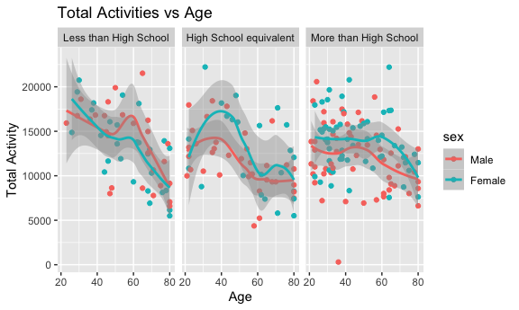

Homework3
================
Siyan Wen
2023-10-12

``` r
library(tidyverse)
```

    ## ── Attaching core tidyverse packages ──────────────────────── tidyverse 2.0.0 ──
    ## ✔ dplyr     1.1.3     ✔ readr     2.1.4
    ## ✔ forcats   1.0.0     ✔ stringr   1.5.0
    ## ✔ ggplot2   3.4.3     ✔ tibble    3.2.1
    ## ✔ lubridate 1.9.2     ✔ tidyr     1.3.0
    ## ✔ purrr     1.0.2     
    ## ── Conflicts ────────────────────────────────────────── tidyverse_conflicts() ──
    ## ✖ dplyr::filter() masks stats::filter()
    ## ✖ dplyr::lag()    masks stats::lag()
    ## ℹ Use the conflicted package (<http://conflicted.r-lib.org/>) to force all conflicts to become errors

``` r
library(ggridges)

knitr::opts_chunk$set(
  fig.width = 6,
  fig.asp = .6,
  out.width = "90%"
)
```

## Problem 1

``` r
library(p8105.datasets)
data("instacart")
```

**Description:**. This dataset contains online grocery data from a
online grocery platform called instacart. The size of this dataset is
`1384617` rows and `15` columns. There are four variables are
`character variables` including evaluation set, product name, aisle and
department. The rest of variables are all `integer variables`. In total,
it has 15 variables including
`order id, product id, customer id, aisle name, department name` and so
on. Department name provide general type information of that specific
product and then aisle name provide the detail information about which
type of product this one belongs to. From the dataset, we can know lots
from information. For example, order number 1 contains 4 Bulgarian
Yogurt that has its product id to be 49302. This Bulgarian Yogurt
belongs to dairy eggs department and also yogurt aisle.

#### The Total number of Aisles

``` r
number_aisle<-
  instacart|>
  count(aisle_id,aisle,sort=TRUE)
```

There are `134` aisle in total within this instacart dataset.
`Fresh vagetable` aisle is the most items ordered from.

#### Plot

``` r
number_aisle|>
  filter(n>10000)|>
  ggplot(aes(x=aisle_id,y=n))+
  geom_point()+
  xlim(c(0, 140)) + 
  ylim(c(0, 160000)) + 
  labs(y="Number of Items Ordered", 
       x="Aisle ID", 
       title="Scatterplot of Number of Items Ordered in Each Aisle", 
       )
```


From this plot, we can clearly see that there are two specific aisles
that most items ordered from.

#### Table

``` r
instacart |> 
  filter(aisle %in% c("baking ingredients", "dog food care", "packaged vegetables fruits")) |>
  group_by(aisle) |> 
  count(product_name) |> 
  mutate(rank = min_rank(desc(n))) |> 
  filter(rank < 4) |> 
  arrange(desc(n)) |>
  knitr::kable()
```

| aisle                      | product_name                                  |    n | rank |
|:---------------------------|:----------------------------------------------|-----:|-----:|
| packaged vegetables fruits | Organic Baby Spinach                          | 9784 |    1 |
| packaged vegetables fruits | Organic Raspberries                           | 5546 |    2 |
| packaged vegetables fruits | Organic Blueberries                           | 4966 |    3 |
| baking ingredients         | Light Brown Sugar                             |  499 |    1 |
| baking ingredients         | Pure Baking Soda                              |  387 |    2 |
| baking ingredients         | Cane Sugar                                    |  336 |    3 |
| dog food care              | Snack Sticks Chicken & Rice Recipe Dog Treats |   30 |    1 |
| dog food care              | Organix Chicken & Brown Rice Recipe           |   28 |    2 |
| dog food care              | Small Dog Biscuits                            |   26 |    3 |

#### Table

``` r
instacart |>
  filter(product_name %in% c("Pink Lady Apples", "Coffee Ice Cream")) |>
  group_by(product_name, order_dow) |>
  summarize(mean_hour = mean(order_hour_of_day)) |>
  pivot_wider(
    names_from = order_dow, 
    values_from = mean_hour) |>
  knitr::kable(digits = 2)
```

    ## `summarise()` has grouped output by 'product_name'. You can override using the
    ## `.groups` argument.

| product_name     |     0 |     1 |     2 |     3 |     4 |     5 |     6 |
|:-----------------|------:|------:|------:|------:|------:|------:|------:|
| Coffee Ice Cream | 13.77 | 14.32 | 15.38 | 15.32 | 15.22 | 12.26 | 13.83 |
| Pink Lady Apples | 13.44 | 11.36 | 11.70 | 14.25 | 11.55 | 12.78 | 11.94 |

## Problem 2

``` r
library(p8105.datasets)
data("brfss_smart2010")
```

#### Clean the data

``` r
brfss_smart2010_clean<-
  brfss_smart2010|>
  janitor::clean_names()|>
  filter(topic=="Overall Health")|>
  filter(response==c("Excellent", "Very good", "Good", "Fair", "Poor"))|>
  mutate(response=factor(response, levels = c("Poor", "Fair", "Good", "Very good", "Excellent"), ordered = TRUE))
```

``` r
brfss_state2002<-brfss_smart2010_clean|>
  filter(year=="2002")|>
  group_by(locationdesc)|>
  summarize(n_obs1=n())|>
  separate(locationdesc,into=c("state", "location"),sep='-')|>
  group_by(state)|>
  summarize(n_obs2=n())|>
  filter(n_obs2>=7)
```

    ## Warning: Expected 2 pieces. Additional pieces discarded in 1 rows [18].

``` r
brfss_state2010<-brfss_smart2010_clean|>
  filter(year=="2010")|>
  group_by(locationdesc)|>
  summarize(n_obs1=n())|>
  separate(locationdesc,into=c("state", "location"),sep='-')|>
  group_by(state)|>
  summarize(n_obs2=n())|>
  filter(n_obs2>=7)
```

    ## Warning: Expected 2 pieces. Additional pieces discarded in 1 rows [49].

In 2002, `no` states were observed at 7 or more locations. In 2010,
there are `9` states were oboserved at 7 or more locations.

#### “Spaghetti” plot

``` r
#Constract dataset
brfss_excellent<-
  brfss_smart2010_clean|>
  filter(response=="Excellent")|>
  select(year,locationabbr,data_value)|>
  group_by(year,locationabbr)|> 
  summarize(mean_data_value=mean(data_value))
```

    ## `summarise()` has grouped output by 'year'. You can override using the
    ## `.groups` argument.

``` r
#Making plot
ggplot(brfss_excellent,aes(x=year,y=mean_data_value,group=locationabbr,color=locationabbr)) +
  geom_line()+
  xlim(c(2002, 2010)) + 
  ylim(c(5, 35)) + 
  labs(y="Years", 
       x="Mean Data Value", 
       title="“Spaghetti” plot of average data value over time", 
       )
```

    ## Warning: Removed 2 rows containing missing values (`geom_line()`).


Based on this plot, we will be able to see the average data value from
2002 to 2010 in different states. Generally, we can see that the lowest
point of average data value in all states is located in the year of
2005. \#### Two-panel Plot

``` r
brfss_two_panal<-
  brfss_smart2010_clean|>
  filter(locationabbr=="NY",year=="2006"|year=="2010")|> 
  select(year,data_value,locationdesc,response)

ggplot(brfss_two_panal, aes(x=response, y=data_value,group=locationdesc,color=locationdesc)) +
geom_line()+
labs(y="Data Value", 
       x="Response", 
       title="Two-panel Plot of Data Value over Responses in 2006 and 2010 among Locations", 
       )+
facet_grid(.~ year) 
```


We can see that there are only four locations that have been recorded in
2006. However, in 2010, the dataset included more data from more
locations in the NY states. Generally speaking, the data value increases
as the response move from `poor` to `good`. Then, data value from most
locations will continue experiencing an short increase from `good` to
`very good` response, but after that, these data value will decrease
from `good` to `excellent` response. However, for the data value from
Queens in 2006 and for the data from Bronx, Queens and Kings in 2010,
they experienced the decrease started from `good` response.

## Problem 3

#### Clean the dataset

``` r
nhanes_accel_df= read_csv("data/nhanes_accel.csv")|>
  janitor::clean_names()|>
  drop_na()|>
  mutate(seqn=as.character(seqn))
```

    ## Rows: 250 Columns: 1441
    ## ── Column specification ────────────────────────────────────────────────────────
    ## Delimiter: ","
    ## dbl (1441): SEQN, min1, min2, min3, min4, min5, min6, min7, min8, min9, min1...
    ## 
    ## ℹ Use `spec()` to retrieve the full column specification for this data.
    ## ℹ Specify the column types or set `show_col_types = FALSE` to quiet this message.

``` r
nhanes_covar_df= read_csv("data/nhanes_covar.csv",skip=4)|>
  janitor::clean_names()|>
  filter(age>=21,)|>
  drop_na()|>
  mutate(seqn=as.character(seqn))|>
  mutate(sex=factor(sex))|>
  mutate(education=factor(education))
```

    ## Rows: 250 Columns: 5
    ## ── Column specification ────────────────────────────────────────────────────────
    ## Delimiter: ","
    ## dbl (5): SEQN, sex, age, BMI, education
    ## 
    ## ℹ Use `spec()` to retrieve the full column specification for this data.
    ## ℹ Specify the column types or set `show_col_types = FALSE` to quiet this message.

``` r
nhanes_covar_df$education<-factor(nhanes_covar_df$education, levels=1:3, labels = c("Less than High School", "High School equivalent", "More than High School"))

nhanes_covar_df$sex<-factor(nhanes_covar_df$sex, levels=1:2, labels = c("Male", "Female"))

merged_nhanes <- inner_join(nhanes_covar_df,nhanes_accel_df, by = "seqn")
```

#### Create a table& Age Distribution

``` r
sex_education_table<-table(nhanes_covar_df$sex, nhanes_covar_df$education)
sex_education_df <- as.data.frame.matrix(sex_education_table)
print(sex_education_df)
```

    ##        Less than High School High School equivalent More than High School
    ## Male                      27                     35                    56
    ## Female                    28                     23                    59

``` r
ggplot(nhanes_covar_df, aes(x = education, y = age, fill = sex)) +
  geom_boxplot() +
  labs(
    title = "Boxplot of Age Distributions for Gender by Education Category",
    x = "Education Category",
    y = "Age"
  ) +
  scale_fill_manual(values = c("Male" = "skyblue", "Female" = "pink")) 
```


Based on the Boxplot, we can see that the age distribution for men and
women are similar to each other in the `Less than High School` and
`More than High School` Education Category. However, in the
`High School equivalent` category, female are relatively older than male
based on this dataset.

#### Total Activity Plot

``` r
merged_nhanes$total_activity<-rowSums(merged_nhanes[,6:1445])
ggplot(merged_nhanes, aes(x = age, y = total_activity,group=sex, color=sex)) +
  geom_point()+
  geom_smooth() +
  labs(
    title = "Total Activities vs Age",
    x = "Age",
    y = "Total Activity"
  ) +
  facet_grid(.~ education) 
```

    ## `geom_smooth()` using method = 'loess' and formula = 'y ~ x'



Based on this plot, the total activities decreases when people get older
and older across all three education category for both men and women.
For people who received `less than high school` education, they have two
high total activity periods in their lifetime. One of them locates at
around 20 years old and the other peak is at around 58 years old. Women
have higher total activities than men earlier in their life and men have
their higher activities than women later in life.For people who received
`High School equivalent` education, they have only one total activity
peak during their life. This one big peak located at around 40 years old
for both men and women. For `More than High School` category, their
total activity over their lifetime is relatively stable. Generally
speaking, women have higher total activities than men for
`High School equivalent` and `More than High School` category.

#### 24-hour Activity Plot

``` r
minutes <- seq(from = 1, to = 1440, by = 1)

new_nhanes_accel_df<-
  pivot_longer(nhanes_accel_df,min1:min1440,
               names_prefix = "min",
               names_to = "minutes",
               values_to = "activity")
nhanes <- inner_join(nhanes_covar_df,new_nhanes_accel_df,by = "seqn")

ggplot(nhanes, aes(x = minutes , y = activity, group=sex, color=sex)) +
  geom_line(aes(color = sex),alpha=0.2)+
  geom_smooth(aes(color = sex), se = FALSE, linetype = "longdash") +
  labs(
    title = "Activities vs Minutes",
    x = "Minutes",
    y = "Activities"
  )+
  scale_color_manual(values = c("Male" = "dodgerblue", "Female" = "deeppink"))+
  facet_grid(.~ education)
```

    ## `geom_smooth()` using method = 'gam' and formula = 'y ~ s(x, bs = "cs")'


The distribution of the data can be seen in line plot. From the smooth
line, we can see that both women and men show similar patterns among
three different education categories. However, based on the line, we can
see that male from higher eductaion level tends to have more activities
in the morning, and women from higher education level tends to have more
activities in the afternoon.
